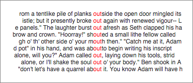

# Keyword-In-Context

A visualization that displays a keyword in context view given a text and a query. An example is show below with the query highlighted in red.



# Usage

There are two primary ways to use this component. Via `script` tags, which is suitable for beginners, or as a react component for those more experienced in web development.

## Via Script Tags

To use the component via script tags. Download this repository and look in the `dist` folder. There are two files there of particular note

 - `keyword_in_context.js` - The component.

 - `keyword_in_context.deps.js` - The dependencies for the file above split out into a separate file.

All of these files are minified which may make them hard to read. So they all have corresponding source maps that end in `.map`.

You should copy both these files into your project.

`Sample HTML file — This is your index.html or similar`
```html
<!DOCTYPE html>
<meta charset="utf-8">
<html>
<head>
  <title></title>
  <script type="text/javascript" src="./keyword_in_context.deps.js"></script>
  <script type="text/javascript" src="./keyword_in_context.js"></script>
</head>

<body>
  <div id='main'></div>
</body>

<script type="text/javascript">
  // This config can be loaded from an external location using ajax.
  var config = {
    "contextSize": 20,
    "caseSensitive": false,
    "query": "",
    "limit": 100
  };

  // The data can be loaded from an external location.
  var data = [
    {
      "name": "Alice in Wonderland" ,
      "text": "Alice was beginning to get very tired of sitting by her sister"
    }
  ];

  // The container we will render our component into.
  var container = document.querySelector("#main");

  // What is the query text (the keyword we are looking for).
  var query = 'of';

  // Package it all up and call the show function
  var opts = {
    config: config,
    data: data,
    container: container,
    query: query
  }
  KeywordInContext.show(opts)
</script>
</html>
```

You can open this file in your browser to see it in action, but you will probably want to move to using a webserver, a simple one is the one built into python `python -m SimpleHTTPServer`.

## As a react component

This module is implemented as a react component and can be used as such. Example code below

```jsx
<KeywordInContext
  caseSensitive={config.caseSensitive}
  contextSize={config.contextSize}
  text={data[0].text}
  query={query}
  limit={config.limit}
/>
```

You would most likely get the component via NPM using `npm install keyword-in-context`. Since the project is written in ES6 and React/JSX you will need a build system that can transpile these to ES5. We use *webpack*, see this repo and our webpack.config.js for guidance.

See below for documentation of parameters

# Parameters

 - caseSensitive [Boolean]: Whether search is case sensitive.
 - contextSize [Integer]: The number of characters to display on either side of the match.
 - text [String]: The text to search.
 - query [String]: The text to search for.
 - limit [Integer] (optional): Max number of matches to render.

# Customization

CSS can be used to customize the display of this component and it is expected that you would use css to customize the component to fit in your context (e.g. constrain the height of the component). See [this stylesheet](src/components/match_with_context/match_with_context.css) for a sense of what styles you can define.

# Dev Workflow

The project is written in ES6/ES2015 with React and JSX and uses webpack for building and webpack-dev-server during development.

 These can be accessed via npm scripts

`npm start` - to start the server in dev mode (with a watcher). Go to localhost:8080/demo.html when this is running to start execution from html.html. You can change the value in sample_data and refresh to see a change in the vis.

`npm run build-fast` - execute the build without minification.

`npm run build-all` - execute the build.

See `webpack.config.js` and `webpack.dev.config.js` for details.
